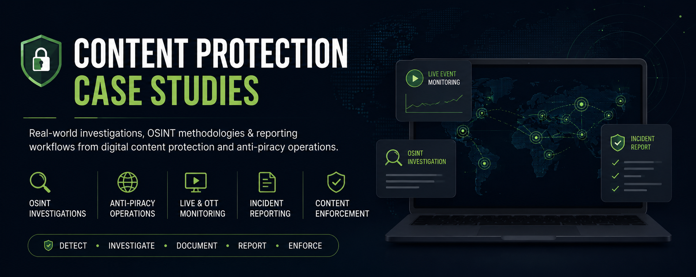

# Content Protection Case Studies

A professional portfolio showcasing investigation methodologies, anti-piracy workflows, content protection operations, and incident reporting practices used in digital content enforcement environments.

## Overview

This repository contains sample case studies, investigation frameworks, reporting templates, and operational workflows related to:

* Digital Content Protection
* Anti-Piracy Operations
* Open Source Intelligence (OSINT)
* OTT & Streaming Monitoring
* Live Sports Content Protection
* Domain & URL Analysis
* Incident Reporting & Documentation
* Digital Rights Enforcement

The purpose of this repository is to demonstrate practical knowledge of content protection operations, investigation methodologies, evidence collection, and reporting standards commonly used in media protection and anti-piracy environments.

---

## Repository Structure

### Case Studies

Practical examples based on real-world content protection scenarios.

* Live Sports Piracy Investigation
* OTT Content Protection
* Third-Party Streaming Application Investigation

### Investigation Methodologies

Standardized approaches used during investigations.

* Domain Investigation Workflow
* URL Analysis Framework
* Evidence Collection Process

### Reporting Templates

Documentation and reporting examples.

* Incident Report Template
* Daily Monitoring Report
* Weekly Monitoring Report

---

## Key Areas of Expertise

### Content Protection

Monitoring and identifying unauthorized distribution of premium digital content across websites, domains, and third-party platforms.

### Anti-Piracy Operations

Detection, documentation, and escalation of infringing content through structured investigative workflows.

### OSINT Investigations

Collection and analysis of publicly available information to identify content distribution sources and associated infrastructure.

### Incident Reporting

Preparation of structured reports, evidence packages, and investigation summaries to support enforcement activities.

---

## Skills Demonstrated

* Content Protection
* Anti-Piracy Operations
* Open Source Intelligence (OSINT)
* Domain Analysis
* URL Analysis
* OTT Monitoring
* Live Event Monitoring
* Evidence Collection
* Incident Reporting
* Digital Rights Enforcement
* Investigation Documentation
* Stakeholder Reporting

---

## Disclaimer

The content provided in this repository is intended for educational and professional portfolio purposes only.

No confidential client information, proprietary tools, internal workflows, or sensitive operational data are included. All examples have been generalized to demonstrate investigation and reporting methodologies while maintaining professional and ethical standards.

---

## Author

**Shiv Mishra**

Digital Content Protection Analyst | OSINT Investigator | Anti-Piracy Operations Specialist

Open to opportunities in:

* Content Protection
* Anti-Piracy Operations
* OSINT Analysis
* Brand Protection
* Trust & Safety
* Digital Rights Enforcement
